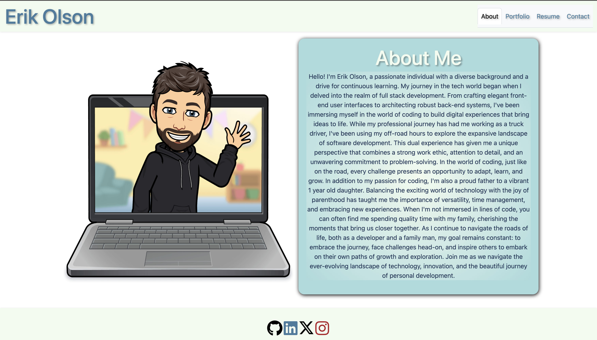
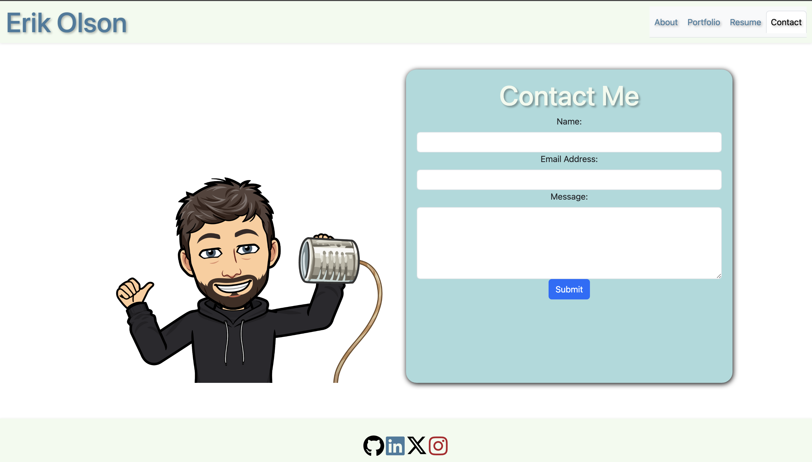

# Erik Olson's Portfolio

## Description
This is my portfolio website created using React. On it you will find a brief description of myself along with navigation links to other sections of the site. You can view a page that will provide you with descriptions and links to 6 projects that I have worked on in the past. There are two other pages for resume information, and a method to contact me. 

In the footer, you will also find links to my Github, LinkedIn, Twitter and Instagram accounts.

## Usage
This portfolio is deployed on Netlify, and can be accessed through the following link: [Erik Olson's Portfoilio](https://eriksportoflio.netlify.app/)

## Screenshots
Here is the page presented to you when first visiting the site.

This is a screenshot of the contact page.

## Link to GitHub Repository
[Github](https://github.com/ErikAmerico/Portfolio2)

## Contact

GitHub: [ErikAmerico](https://github.com/erikamerico)
    
Email: erikamerico1991@gmail.com

Phone: 781-333-1765